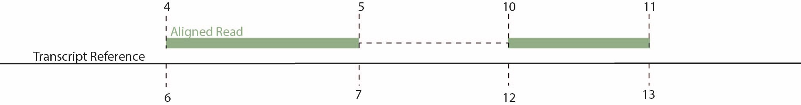

```{r, include = FALSE}
library(rmarkdown)
knitr::opts_chunk$set(
  collapse = TRUE,
  comment = "#>"
)


```


```{r setup, include=FALSE}
knitr::opts_chunk$set(echo = TRUE)
```


# The COMRADES experiment
\
The COMRADES experimental protocol for the prediction of RNA structure in vivo was first published in 2018 (Ziv et al., 2019) where they predicted the structure of the Zika virus. The protocol has subsequently been use to predict the structure of SARS-CoV-2 (Ziv et al., 2020). Have a look to get an understanding of the protocol:

* COMRADES determines in vivo RNA structures and interactions. (2018). Omer Ziv, Marta Gabryelska, Aaron Lun, Luca Gebert. Jessica Sheu-Gruttadauria and Luke Meredith, Zhong-Yu Liu,  Chun Kit Kwok, Cheng-Feng Qin, Ian MacRae, Ian Goodfellow , John Marioni, Grzegorz Kudla, Eric Miska.  Nature Methods. Volume 15. https://doi.org/10.1038/s41592-018-0121-0   

* The Short- and Long-Range RNA-RNA Interactome of SARS-CoV-2. (2020). Omer Ziv, Jonathan Price, Lyudmila Shalamova, Tsveta Kamenova, Ian Goodfellow, Friedemann Weber, Eric A. Miska. Molecular Cell,
Volume 80
    https://doi.org/10.1016/j.molcel.2020.11.004
    

![Figure from Ziv et al., 2020. Virus-inoculated cells are crosslinked using clickable psoralen. Viral RNA is pulled down from the cell lysate using an array of biotinylated DNA probes, following digestion of the DNA probes and fragmentation of the RNA. Biotin is attached to crosslinked RNA duplexes via click chemistry, enabling pulling down crosslinked RNA using streptavidin beads. Half of the RNA duplexes are proximity-ligated, following reversal of the crosslinking to enable sequencing. The other half serves as a control, in which crosslink reversal proceeds the proximity ligation](comradesProtocol.jpg){width=100%}

After sequencing, short reads are produced similar to a spliced / chimeric RNA read but where one half of the read corresponds to one half of a structural RNA duplex and the other half of the reads corresponds to the other half of the structural RNA duplex. This package has been designed to analyse this data. The short reads need to be prepared in a specific way to be inputted into this package. 

---

# COMRADES data pre-processing

## Nextflow pipeline 
\
Fastq files produced from the comrades experiment can be processed for input into the comradesOO using the Nextflow pre-processing pipeline, to get more information visit here. (URL). The pipeline has a docker image and takes the reads through trimming alignment, QC and the production of the files necessary for input to comradesOO.

<center>
{width=50%}
</center>


## Nextflow pipeline output
\
The main output files are the files entitled *X_gapped.txt*. These are the input files for comradesOO. The columns of the output files are as follows:

1. Read Name
2. Read Sequence
3. Side 1 transcript ID
4. Side 1 Position start in read sequence
5. Side 1 Position end in read sequence
6. Side 1 Coordinate start in transcript
7. Side 1 Coordinate end in transcript
8. NA
9. Side 1 transcript ID
10. Side 1 Position start in read sequence
11. Side 1 Position end in read sequence
12. Side 1 Coordinate start in transcript
13. Side 1 Coordinate end in transcript
14. NA





---

# Input for comrades-OO
\
The main input files for comrades-OO is a tab delimited text file containing the reads and mapping location on the transcriptome. This can be manually created although the easiest way to obtain these files is to use the nextflow pipeline detailed above. There is test data that ships with the package, this contains data for the 18S rRNA and it's interactions with the 28S rRNA. However, full data-sets already published can be found here: [SARS-CoV-2 Dataset](https://www.ncbi.nlm.nih.gov/geo/query/acc.cgi?acc=GSE154662) (files ending in "txt.gz")  and here: NB URL with an additional data-set available here (URL).


Pre-requisites:

1. Install the comradesOO package
2. Input files (nexflow, custom or downloaded)
3. Meta-data table
4. ID of the RNA of interest (from the transcript reference )
5. A fasta sequence of the RNA of interest  (from the transcript reference )
6. A set of interactions to compare to (optional)
6. Reactivities (optional)

---

## Load the Library

```{r, echo = T, results = 'hide',message=FALSE}
# Load the comrades-OO Library 
library(comradesOO)
```


```{r, echo = F, results = 'hide',message=FALSE}
# Here are the other libraries on which comradesOO relies
library(seqinr)
library(GenomicRanges)
library(ggplot2)
library(reshape2)
library(MASS)
library(ggplot2)
library(doParallel)
library(igraph)
library(R4RNA)
library(RColorBrewer)
library(heatmap3)
library(mixtools)
library(TopDom)
library(tidyverse)
library(RRNA)
library(ggrepel)
```

```{r, echo = T, results = 'hide',message=FALSE}
# Load the comrades-OO Library 
library(comradesOO)
```


# also load other libraries that will be important]\\\\\\\9

\

## Make the Sample table

The metadata table has 4 columns and the column names are specific and case-sensitive. 

+ **file**              -  The imput file name and location of the sample
+ **group**             -  "c" or "s" denoting wether the sample is a control or not
+ **sample**            -  Sample number 
+ **sampleName**        -  A unique sample name 

\

```{r}
# Set up the sample table
sampleTableRow1 = c(system.file("extdata", 
                                "s1.txt", 
                                package="comradesOO"), "s", "1", "s1")
sampleTableRow2 = c(system.file("extdata", 
                                "c1.txt", 
                                package="comradesOO"), "c", "1", "c1")
sampleTable2 = rbind.data.frame(sampleTableRow1, sampleTableRow2)

# add the column names 
colnames(sampleTable2) = c("file", "group", "sample", "sampleName")

sampleTable2
```

\

## Choose RNA

The name of the RNA to analyse must be as it appears in the input files and transcriptome reference used for mapping. 


```{r}
rna = c("ENSG000000XXXXX_NR003286-2_RN18S1_rRNA")
```

\


## Transript fasta

Fasta sequence(s) of the RNA(s) of interest, ideally taken from the transcriptome reference fasta used for mapping.

```{r}
path18SFata <- system.file("extdata", 
                           "18S.fasta", 
                           package="comradesOO")

rnaRefs = list()
rnaRefs[[rna]] = read.fasta(path18SFata)

```

\


## A set of interactions to compare to (optional)

This is optional but you can provide a table of interactions for the RNA to compare against. This can be useful when comparing different samples or to another predicted structure for the same RNA. The table should be a tsv with to columns (i and j) each row shows an interaction between nucleotide i and j for comparison.

```{r}
path18SFata <- system.file("extdata", 
                           "ribovision18S.txt", 
                           package="comradesOO")
known18S = read.table(path18SFata,
                      header = F)
```

\


## Reactivities (optional)

NB description

```{r}
pathShape <- system.file("extdata",
                         "reactivities.txt", 
                         package="comradesOO")
shape = read.table(pathShape,
                      header = F)
```

---

# Quick start
\
There is a wrapper which will perform the three main steps in the analysis with 1 command (Clustering, trimmming and folding). However, for first time users or users with new datasets this is not recommended. Some of the optional arguments for folding and clustering can be informed by the analysis of the previous stages. 

```{r}
# runComradesOO(rna,
#                     rnaSize =0 ,
#                     sampleTable,
#                     cores = 3,
#                     stepCount = 2,
#                     clusterCutoff = 20,
#                     clusteredCds,
#                     trimFactor = 2.5, 
#                     clusterCutoff = 1,
#                     rnaRefs,
#                     start,
#                     end,
#                     evCutoff = 1,
#                     ensembl = 50,
#                     constraintNumber = 20,
#                     shape = 0)

```

---

# Slow Start
\

The package has 3 main processes; clustering, cluster trimming and folding. The next sections take you through the usage of each of these main stages and the optional but recommended analysis.

<center>

</center>


## Make the Object
\

The instance of the *comradesDataSet* object that is created stores the information from the experiment including raw and processed data for the dataset. The instance is a container that carries different types of data in slots.

### Slots / Attributes

##### Analysis stage 
\

The slots for processed and unprocessed data keep the data from each stage of the analysis, this allows the user to quickly access any part of the results. Checking the status of the object will allow you to see which stages of the analysis are present for each of the attributes.  

##### Meta-data
\

+   **rnas**                    -  The RNA ID for this instance
+   **rnaSize**                 -  The size in nuceloties of the RNA for this instance
+   **sampleTable**             -  The meta-data for the instance ( detailed above )

##### Raw-data and processed data 
\

+   **hybFiles**                -  Data in the original input file format (list)
                                hybFiles - rna ID - Analysis stage - Sample Name
+   **matrixList**              - Data in contact matrix format (list) (cells contain the number of reads assinged to those interacting coordinates)
                                hybFiles - rna ID - Analysis stage - Sample Name
+   **clusterGrangesList**      - Granges of clusters identified (list)
                                hybFiles - rna ID - Analysis stage - Sample Name
+   **clusterTableList**        - Data frame of clusters identified (list)
                                hybFiles - rna ID - Analysis stage - Sample Name
+   **clusterTableFolded**      - A table of all clusters with predicted structures included
+   **interactionTable**        - A table contraints predicted for folding
+   **viennaStructures**        - A list of predicted structures in vienna format       


### comradesDataSet - make object 
\

```{r}
# load the object
cds = comradesDataSet(rnas = rna,
                      sampleTable = sampleTable2)
```


## Access the data within the instance
\

You can check on major parts of the object and return slots and other information using the accessor methods

### General Acessors 
\

```{r}
# Check status of instance 
cds
```

```{r}

# Returns the size of the RNA
rnaSize(cds)
```

```{r}
# Returns the sample table 
sampleTable(cds)
```

```{r}
# Returns indexes of the samples in the control and not control groups
group(cds)
```

```{r}
# Get the sample names of the instance
sampleNames(cds)
```

```{r, eval=FALSE,echo=FALSE}
# Return the hybFiles slot
hybFiles(cds)
```

```{r, eval=FALSE, echo=FALSE}
# Return the matrixList slotmatrixList(cds) 
```


### Get Data 
\

Get data is more generic method for retrieving data from the object and returns a list, the number of entries in the list is number of samples in the dataset and the list contain entries of the data type and analysis stage you select.


```{r}
data = getData(cds,       # The object      
        "hybFiles",       # The Type of data to return     
        "original")[[1]]  # The stage of the analysis for the return data
head(data)
```

## Check Interactions 
\

The first step is to assess the species of RNA in the instance, the instance will probably contain inter-RNA interactions and intra-RNA interactions for many different RNAs. A number of tables showing the different RNAs / interactions and the ammount of reads assigned to each can be returned with the following methods:

### topTranscripts
\


```{r}

# Returns the RNAs with highest number of assigned reads 
topTranscripts(cds, # The comradesDataSet instance
               2)  # The number of entried to return

```

### topInteractors
\

```{r}
# Returns the RNAs that interact with the RNA of interest
topInteracters(cds, # The comradesDataSet instance
               1)   # The number of entries to return
```


### topInteractions
\

```{r}
# Returns the Interacions with the highest number of assigned reads
topInteractions(cds, # The comradesDataSet instance
                2)   # The number of entries to return

```


---

## Clustering 
\

In the COMRADES data, crosslinking and fragmentation leads to the production of redundant structural information, where the same in vivo structure from different RNA molecules produces slightly different RNA fragments. Clustering of these duplexes that originate from the same place in the reference transcript reduces computational time and allows trimming of these clusters to improve the folding prediction.
To allow clustering, gapped alignments can be described by the transcript coordinates of the left (L) and right (R) side of the reads and by the nucleotides between L and R (g). Reads with similar or identical g values are likely to originate from the same structure of different molecules. In COMRADES-OO, an adjacency matrix is created for all chimeric reads based on the nucleotide difference between their g values (Deltagap). This results in Deltagap = 0 for identically overlapping gaps and increasing Deltagap values for gapped reads with less overlap:

+ Deltagap(gi,gj) = max(width(gi),width(gj)) – widthofIntersection(gi,gj)

For short range interactions ( g <= 10 nt ) the weights are calculated such that the highest weights are given to exactly overlapping gapped alignments and a weight of 0 is assigned to alignments that do not overlap.

+ E(gi, gj) = 10 - Deltagap(gi, gj)

Long range interactions (g >10) are clustered separately and their weights are calculated as follows and edges with weights lower that 0 are set to 0. Meaning that gaps that do not overlap by at least 15 nucleotides are considered in different clusters. 

+ E(gi, gj) = 15 - Deltagap(gi, gj)

From these weights the network can be defined for short- and long-range interaction as: G = (V, E). To identify clusters within the graph (subgraphs) the graph is clustered using random walks with the cluster_waltrap function (steps = 2) from the iGraph packageå, there is an option for users to remove clusters with less than a specified amount of reads.  These clusters often contain a small number of longer L or R sequences due to the random fragmentation in the COMRADES protocol. 


```{r}
# Cluster the reads
clusteredCds = clusterComrades(cds = cds,         # The comradesDataSet instance 
                               cores = 1,         # The number of cores
                               stepCount = 2,     # The number of steps in the random walk
                               clusterCutoff = 3) # The minimum number of reads for a cluster to be considered
```


```{r}
# Check status of instance 
clusteredCds
```


### Cluster Numbers
\

```{r}
# Returns the number of clusters in each sample
#clusterNumbers(clusteredCds)
```


### Read numbers in clusters
\

```{r}
# Returns the number reads in clusters
readNumbers( clusteredCds)
```

### Cluster Tables
\

The cluster tables contain coordinates of the clusters in data.frame format. Each cluster has a unique ID and size.x corrasponds to the number of reads assigned to that cluster or supercluster. ls, le, rs and le give the coordinates of the interaction. 

```{r}
getData(clusteredCds,        # The object             
        "clusterTableList",  # The Type of data to return     
        "original")[[1]]     # The stage of the analysis for the return data
```

### Cluster GRanges
\

You can also ectract a GRanges of the individual reads and their cluster membership:

```{r,  eval=FALSE, echo=FALSE}
getData(clusteredCds,         # The object
        rna,                  # The rna of interest
        "clusterGrangesList", # The Type of data to return     
        "original")[[1]]      # The stage of the analysis for the return data
```

## Cluster Trimming 
\

Given the assumption that the reads within each cluster likely originate from the same structure in different molecules these clusters can be trimmed to contain the regions from L and R that have the most evidence the clustering and trimming is achieved with the clusterComrades and trimClusters methods. 

```{r}
# Trim the Clusters
trimmedClusters = trimClusters(clusteredCds = clusteredCds, # The comradesDataSet instance 
                               trimFactor = 1,              # The cutoff for cluster trimming (see above)
                               clusterCutoff = 30)          # The minimum number of reads for a cluster to be considered
```

```{r}
# Check status of instance 
trimmedClusters
```


## Folding 
\

The final step is folding NB:  add descriptions


```{r,error=FALSE,eval = FALSE, results=FALSE,message=FALSE}
# Fold the RNA in part of whole
foldedCds = foldComrades(trimmedClusters,
                         rna = rna,
                         rnaRefs = rnaRefs,
                         start = 1700,
                         end = 1869,
                         shape = 0,
                         ensembl = 40,
                         constraintNumber  = 5,
                         evCutoff = 50)
```


```{r,eval = FALSE,}
# Check status of instance 
foldedCds
```

---

# Other Plots and Functionality


## Plotting contact matrices 
\

Plots can be made automatically from the *plotMatrices* function. 

```{r}
# Plot heatmaps for each sample
plotMatrices(cds = cds,         # The comradesDataSet instance 
             type = "original", # The "analysis stage"
             directory = 0,     # The directory for output (0 for standard out)
             a = 1,             # Start coord for x-axis
             b = rnaSize(cds),  # End coord for x-axis
             c = 1,             # Start coord for y-axis
             d = rnaSize(cds),  # End coord for y-axis
             h = 5)             # The hight of the image (if saved)

```


```{r}
# Plot heatmaps for all samples combined and all controls combined
plotMatricesAverage(cds = cds, # The comradesDataSet instance 
             type = "original", # The "analysis stage"
             directory = 0,     # The directory for output (0 for standard out)
             a = 1,             # Start coord for x-axis
             b = rnaSize(cds),  # End coord for x-axis
             c = 1,             # Start coord for y-axis
             d = rnaSize(cds),  # End coord for y-axis
             h = 5)             # The hight of the image (if saved)

```

---


## Identifying domains 
\

The accuracy of *insilico* prediction decreases with the size of the RNA. To counteract this effect, for large RNAS (?400bp), it can be useful to segment the RNA and fold the segments seaparately. DNA and RNA that form secondary and tertiary structures often have domains where there is more inter-domain interactions that inra-domain interactions. The *TopDom* package was designed to identify these domains for HI-C data. Using this package you can identify domains in the RNA structural data and can be used to inform the folding. 

```{r, eval = FALSE}
domainDF = data.frame()
for(j in c(20,30,40,50,60,70)){
    #for(i in which(sampleTable(cds)$group == "s")){
    
    timeMats = as.matrix(getData(x = cds, 
                                 data = "matrixList", 
                                 type = "noHost")[[1]])
    
    timeMats = timeMats/ (sum(timeMats)/1000000)
    write.table(timeMats, file = "./conmat.txt",quote = F,row.names = F, col.names = F)
    
    tdData2 = readHiC(
        file = "./conmat.txt",
        chr = "rna18s",
        binSize = 10,
        debug = getOption("TopDom.debug", FALSE)
    )
    
    tdData =  TopDom(
        tdData2 ,
        window.size = j,
        outFile = NULL,
        statFilter = TRUE,
        debug = getOption("TopDom.debug", FALSE)
    )
    
    td = tdData$domain
    td$sample = sampleTable(cds)$sampleName[1]
    td$window = j
    domainDF = rbind.data.frame(td, domainDF)
    
}


ggplot(domainDF) +
    geom_segment(aes(x = from.coord/10,
                     xend = to.coord/10, y = as.factor(sub("s","",sample)),
                     yend = (as.factor(sub("s","",sample)) ), colour = tag),
                 size  = 20, alpha = 0.8) +
    facet_grid(window~.)+
    theme_bw()

```


---


## Analyse folds

### PCA of ensembl
\

```{r,eval = FALSE,}
plotEnsemblePCA(foldedCds, 
                labels = T, # plot labels for structures
                split = F)  # split samples over different facets (T/f)

```

### Plot to strcutures on an arc diagram
\


```{r,eval = FALSE,}
plotComparisonArc(foldedCds = foldedCds,
                  s1 = "s1",            # The sample of the 1st structure
                  s2 = "s1",            # The sample of the 2nd structure
                  n1 = 1,               # The number of the 1st structure
                  n2 = 2)               # The number of the 2nd structure
```

### Plot one structure
\

```{r eval = F}
plotStructure(foldedCds = foldedCds, 
              rnaRefs = rnaRefs,     
              s = "s1",          # The sample of the structure
              n = 1)             # The number of the structure
```


```{r message=FALSE, echo=F,eval = FALSE, results='hide'}

plotStructure(foldedCds = foldedCds,
              rnaRefs = rnaRefs,
              s =  "s1",        # The sample of the structure
              n = 1)            # The number of the structure

```


## Inter RNA interactions- Plot an interacting partner 
\

Along with the RNA of interest the data also contains inter-RNA interactions with other RNAs from the transcriptome reference. After identifying abundant interactions using topInteractions you can find out where on each RNA these inetractions occur using *getInteractions* and *getReverseInteractions*.

```{r}

getInteractions(cds,
                "ENSG00000XXXXXX_NR003287-2_RN28S1_rRNA") %>%
    mutate(sample =sub("\\d$","",sample) )%>%
    group_by(rna,Position,sample)%>%
    summarise(sum =  sum(depth)) %>%
    ggplot()+
    geom_area(aes(x = Position,
                  y = sum, 
                  fill = sample), 
              stat = "identity")+
    facet_grid(sample~.) +
    theme_bw()

```


```{r}
getReverseInteractions(cds,
                       rna) %>%
    mutate(sample =sub("\\d$","",sample) )%>%
    group_by(rna,Position,sample)%>%
    summarise(sum =  sum(depth)) %>%
    ggplot()+
    geom_area(aes(x = Position,
                  y = sum, 
                  fill = sample), 
                    stat = "identity")+
    facet_grid(sample~.)+
    theme_bw()
```


## Compare to the "Known" structure 
\

The clusters can be compared to set of interactions to see which clusters share coordinates with a this set of interactions. The table should be formatted as a tabale fame of 2 columns (i and j) each colunn containing numerical values giving an interaction between i and j with which the clusters should be compared.

### Make a contact matrix of known / comprative interactions
\

To compare to set of know interactions you need a contact matrix these interactions, for plotting it is sometimes useful to expand the interactions so they can be seen easily. 

```{r}
expansionSize = 5
knownMat = matrix(0, nrow = rnaSize(cds), ncol = rnaSize(cds))
for(i in 1:nrow(known18S)){
    knownMat[ (known18S$V1[i]-expansionSize):(known18S$V1[i]+expansionSize),
              (known18S$V2[i]-expansionSize):(known18S$V2[i]+expansionSize)] =
        knownMat[(known18S$V1[i]-expansionSize):(known18S$V1[i]+expansionSize),
                 (known18S$V2[i]-expansionSize):(known18S$V2[i]+expansionSize)] +1
}
knownMat = knownMat + t(knownMat)

```


### Compare the Clusters
\

Using *compareKnown* you can check which clusters agree with the set of interactions. This functions adds analysis stages "known", "novel" and "knownAndNovel" to the objects data attributes. 

```{r}
# use compare known to gett he known and not know clusters
knowClusteredCds = compareKnown(trimmedClusters, # The comradesDataSet instance 
                                knownMat, # A contact matrix of know interactions
                                "trimmedClusters") # The analysis stage of clustering to compare 

knowClusteredCds
```

### Plot the overlapping clusters
\

You can plot these using the *plotMatrices* function

```{r}
# Plot heatmaps for all samples combined and all controls combined
plotMatricesAverage(cds = knowClusteredCds, # The comradesDataSet instance 
             type = "KnownAndNovel", # The "analysis stage"
             directory = 0,     # The directory for output (0 for standard out)
             a = 1,             # Start coord for x-axis
             b = rnaSize(cds),  # End coord for x-axis
             c = 1,             # Start coord for y-axis
             d = rnaSize(cds),  # End coord for y-axis
             h = 5)             # The hight of the image (if saved)

```


### Cluster Numbers
\


```{r}
# Get the number of clusters for each analysis Stage
clusterNumbers(knowClusteredCds)
```


### Read numbers in clusters
\

```{r}
# Get the number of reads in each cluster for each analysis stage
readNumbers(knowClusteredCds)
```


### Compare structures with known
\

To compare predicted structures with the know stucture use "compareKnownStructures". This will give you the number of base pairs that agree between the ensembl of predicted structures and the structure imputted for comparison. This can be for better viewing. 


```{r,eval = FALSE}
head(compareKnownStructures(foldedCds, 
                            known18S)) # the comarison set
```

```{r,eval = FALSE}
ggplot(compareKnownStructures(foldedCds, known18S)) +
    geom_hline(yintercept = c(0.5,0.25,0.75,0,1), 
               colour = "grey", 
               alpha = 0.2)+
    geom_vline(xintercept = c(0.5,0.25,0.75,0,1), 
               colour = "grey", 
               alpha = 0.2)+
    geom_point(aes(x = sensitivity, 
                   y = precision, 
                   size = as.numeric(as.character(unlist(foldedCds@dgs))),
                   colour = str_sub(structureID, 
                                    start = 1 , 
                                    end = 2))) +
    xlim(0,1)+
    ylim(0,1)+
    theme_classic()

```

